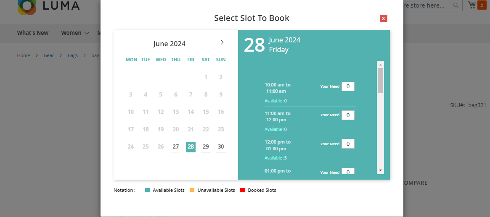

# Magento 2 Booking And Reservation Extension

Transform your Magento 2 store into a dynamic event-driven platform with our Booking and Reservation Extension. Perfect for businesses that require a streamlined and efficient booking system, this extension supports both single and multiple-day bookings, providing an enhanced user experience for your customers.

**[Magento 2 Booking And Reservation Extension]**

## Key Features:

- **Dynamic Booking System:**
  - Create One Booking for Many Days
  - Create Many Bookings in One Day
- **Slot-Based Quantity Measure:**
  - Manage available slots efficiently.
- **Event Creation & Display:**
  - Dynamic event creation with brilliant UI and UX.
- **Real-Time Booking:**
  - Supports real-time booking for hassle-free reservations.
- **Flexible Time Settings:**
  - Customizable time slots and break times.
- **Customer Booking Details:**
  - Customers can view booking details like date and time slots in the cart.
- **Built on Magento MVC and ORM System:**
  - Ensures stability and performance.
- **Hyva Theme Compatibility:**
  - Fully compatible with the Hyva Theme.
- **GraphQL Implementation:**
  - Enhanced performance and flexibility with GraphQL.

## Benefits:

- **Seamless Booking Experience:**
  - Converts your store into an event-driven site (e.g., doctor's appointments, movie bookings).
- **Enhanced Customer Satisfaction:**
  - Customers can easily book products/services according to their needs.
- **Operational Efficiency:**
  - Automates the booking process and ensures accurate availability management.
- **Increased Revenue Potential:**
  - Optimizes the booking experience to drive revenue growth.

## Types of Bookings:

### Many Bookings in One Day
- Set booking time for each slot.
- Define start and end date and time slots.
- Specify break times and slot quantities.
- Manage the status of each day as "Open" or "Close."

### One Booking for Many Days
- Set start and end dates for the booking.
- Define the number of slots available each day.
- Prevent booking for specified days.
- Easily update booking details from the backend.

## Customer Booking Process:

1. Select the product with booking options.
2. Choose the "Book Now" option to open the booking popup.
3. Select the desired date and number of slots.
4. Confirm the booking to add it to the cart.

## Compatibility:
This extension is compatible with Magento 2.x versions, ensuring seamless integration with your existing store setup.

## Installation:
**Install via composer (recommended)**
~~~~~~~~~~~~~~~~~~~~~
composer require mavenbird/booking-reservation-magento2
php bin/magento setup:upgrade
php bin/magento setup:static-content:deploy
php bin/magento setup:di:compile
php bin/magento cache:flush
~~~~~~~~~~~~~~~~~~~~~

## Upgrade/Update Module:
Run the following command in Magento 2 root folder for easy update -
~~~~~~~~~~~~~~~~~~~~~
composer update mavenbird/booking-reservation-magento2
php bin/magento setup:upgrade
php bin/magento setup:static-content:deploy
php bin/magento setup:di:compile
php bin/magento cache:flush
~~~~~~~~~~~~~~~~~~~~~

## Customization Options:
Tailor the booking and reservation system to match your store's branding and operational needs with customizable templates and settings.

**Configure at Your Ease**

## Support:
Dedicated support team available to assist with installation, customization, and any other queries or concerns.
**[support@mavenbird.com](support@mavenbird.com)** 

## Get Started:
Elevate your store with a dynamic booking and reservation system. Enhance customer experience, streamline operations, and drive revenue growth with our Magento 2 Booking and Reservation Extension.

**Thank you!**
